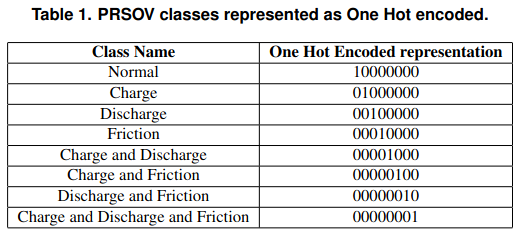

# Disciplina: Inteligência Computacional - GBC073
**Grupo:** Eduarda Lopes, Carla Azevedo, Lucas Matos

---

## Resumo do Enunciado do Trabalho
Reproduzir e analisar experimentos de um artigo que utilize apenas redes neurais (MLP ou CNN) em problemas reais, utilizando o mesmo dataset ou parte dele.
Extrair arquitetura, parâmetros e métricas do artigo, testar variações justificadas para melhorar resultados, e comparar com o baseline.
Apresentar objetivo, relevância, metodologia, resultados, comparação com o artigo, conclusões e código.
Cada grupo deve trabalhar com artigo e problema diferentes, respeitando as restrições de dataset e técnica.

---

## Artigo
**Título:** Application of Deep Learning Models for Aircraft Maintenance
**Autores:** Humberto Hayashi Sano, Lilian Berton
**Publicação:** Anais do XIX Encontro Nacional de Inteligência Artificial e Computacional (ENIAC) - 2022
[Link para o artigo](https://sol.sbc.org.br/index.php/eniac/article/view/22832)

---

## Análise Inicial do Artigo
O estudo utiliza um conjunto de dados contendo 8.000 amostras de pressão regulada, obtidas a partir do funcionamento natural do Environmental Control System (ECS) em aeronaves.

Essas amostras correspondem a válvulas do tipo **Pressure Regulated Shutoff Valves (PRSOV)**, que, devido à operação sob altas pressões e temperaturas, são suscetíveis a **falhas isoladas (single-faults)** ou **múltiplas (multi-faults)**.

O objetivo dos autores é avaliar a eficácia de redes neurais, especificamente **Convolutional Neural Networks (CNN)** e **Multi-Layer Perceptron (MLP)**, na classificação do estado dessas válvulas, utilizando 201 recortes de pressão por válvula para prever a ocorrência de falhas simples ou múltiplas.

O uso de **pressão regulada**, em contraste com estudos anteriores que se basearam em tempos de abertura e fechamento adequados apenas para testes em bancada, representa uma abordagem mais realista para monitoramento em operação.

Como contribuição, o artigo disponibiliza um dataset padronizado, criado variando parâmetros como **coeficiente de fricção, nível de entupimento e falha de mola**, permitindo simular diferentes estados da válvula:

- **Healthy:** 0
- **Single-Faults:** 1, 2, 3
- **Multi-Faults:** 4, 5, 6, 7

Essa variação possibilita a análise do comportamento das válvulas sob diferentes condições de falha, fornecendo uma base robusta para a validação de métodos de diagnóstico de falhas em sistemas aeronáuticos.

---

## Dados e Geração
Os dados utilizados no estudo **não foram obtidos a partir de voos reais**, mas sim por meio de **simulações** executadas em um **modelo Simulink previamente validado**. Para cada amostra do conjunto de dados, foi simulado um ciclo completo de comando da válvula **PRSOV**. A geração dos dados envolveu a variação controlada dos principais parâmetros físicos internos da válvula: **friction**, **charge** e **discharge**.

A classificação das falhas foi definida com base em **conhecimento especializado** sobre o funcionamento das válvulas PRSOV. Especialistas estabeleceram **intervalos válidos** (normais e anormais) para cada parâmetro físico. A partir desses intervalos, foram criadas duas listas por parâmetro, uma contendo valores normais e outra contendo valores anormais. Em seguida, uma **distribuição uniforme** foi utilizada para selecionar, de forma aleatória, os valores que comporiam cada amostra.

Esse procedimento assegura que o dataset tenha **grande diversidade de cenários**, evitando que as redes neurais “decorem” os exemplos e garantindo que elas, de fato, aprendam a reconhecer **padrões de comportamento da pressão associados a falhas**.

No dataset, **cada linha corresponde a uma amostra simulada**, enquanto **cada coluna representa o valor da pressão em um instante de tempo específico**. Assim, cada amostra é composta por **201 valores de pressão**, que constituem as **features** que alimentam os modelos. Dessa forma, o dataset caracteriza-se como uma **série temporal**, representada por um vetor unidimensional de tamanho 201 — valor que corresponde ao comprimento máximo do ciclo temporal simulado.

[Link para o dataset](https://zenodo.org/records/7191171)

O dataset é composto por dois arquivos principais:

| **Arquivo**      | **Descrição**                                                                 |
|------------------|-------------------------------------------------------------------------------|
| **Attribute.csv** | Contém os dados de 8.000 amostras de válvulas. Cada linha representa os valores de pressão temporais em 201 timestamps.                             |
| **Label.csv**     | Contém os rótulos de cada amostra de válvula.            |

### Classes de Válvulas
<table>
  <thead>
    <tr>
      <th>Label</th>
      <th>Classe da Válvula</th>
      <th>Categoria</th>
    </tr>
  </thead>
  <tbody>
    <tr style="background-color:#A8E6CF;">
      <td>0</td>
      <td>Normal</td>
      <td>Healthy</td>
    </tr>
    <tr style="background-color:#FFD3B6;">
      <td>1</td>
      <td>Isolated Failure: Charge Fault</td>
      <td>Falha única na câmara de Carga</td>
    </tr>
    <tr style="background-color:#FFD3B6;">
      <td>2</td>
      <td>Isolated Failure: Discharge Fault</td>
      <td>Falha única na câmara de Descarga</td>
    </tr>
    <tr style="background-color:#FFD3B6;">
      <td>3</td>
      <td>Isolated Failure: Friction Fault</td>
      <td>Falha única de fricção</td>
    </tr>
    <tr style="background-color:#FF8C94;">
      <td>4</td>
      <td>Simultaneous: Charge and Discharge</td>
      <td>Falha dupla (Carga + Descarga)</td>
    </tr>
    <tr style="background-color:#FF8C94;">
      <td>5</td>
      <td>Simultaneous: Charge and Friction</td>
      <td>Falha dupla (Carga + Fricção)</td>
    </tr>
    <tr style="background-color:#FF8C94;">
      <td>6</td>
      <td>Simultaneous: Discharge and Friction</td>
      <td>Falha dupla (Descarga + Fricção)</td>
    </tr>
    <tr style="background-color:#FF8C94;">
      <td>7</td>
      <td>Simultaneous: All Faults</td>
      <td>Falha tripla - as 3 falhas simultaneamente</td>
    </tr>
  </tbody>
</table>

### Pré-Processamento dos Dados
Os valores brutos de pressão apresentam grande variabilidade, podendo sofrer variações superiores a dez vezes entre timestamps consecutivos. Trabalhar com dados não normalizados dificulta o treinamento de redes neurais, pois intervalos muito amplos tornam a identificação de padrões menos eficiente. Portanto, a primeira etapa consistiu na normalização dos valores por timestamp utilizando a fórmula Z-Score:

$$
P_{N_i} = \frac{P_i - \overline{P_i}}{sd(P_i)}
$$

Aqui, \( P_i \) é o conjunto de valores de pressão das válvulas no timestamp \( i \),
e \( \overline{P_i} \) e \( sd(P_i) \) são, respectivamente, a média e o desvio padrão de \( P_i \). O dataset já foi disponibilizado ao público normalizado, então não foi necessário nenhum tipo de pré-processamento posterior.

Após a normalização, é necessário estruturar a saída das redes neurais, já que elas não retornam diretamente a classe em formato textual. Como o problema possui 8 classes distintas, a camada final das redes contém 8 neurônios. Para representar essas classes, utilizou-se a codificação One Hot, em que apenas um dos neurônios é ativado (valor 1) para cada amostra, indicando a classe correspondente; todos os demais permanecem com valor 0. A tabela com as classes PRSOV codificadas em formato One Hot está apresentada a seguir.



---
## Implementação

Tecnologias usadas: Keras library and Jupyter Notebook.

10% das amostras totais são testes - feita preservando a porcentagem de amostras de cada classe, ou seja, de cada classe, 10% das amostras são para teste.
No caso, isso é feito na parte do código:
```python
X_train, X_test, y_train, y_test, y_train_int, y_test_int = train_test_split(
    X, y_cat, y_integers, test_size=0.10, stratify=y_integers, random_state=42),
```
Em que 10% do total das amostras são separados para as variáveis de teste X e Y, enquanto resto fica pra treino. O parâmetro stratify=y_intergers garante que cada label mantenha a mesma proporção de classes do dataset original. É no X_train e Y_train que o cross validation é aplicado.

Nesse caso eu quero avaliar modelos. No artigo usamos k cross validation, sendo k = 10, o que significa que 10% do conjunto de treinamento separado anteriormente é usado como validation set no processo de treinamento. Durante cada treinamento, capturamos a evolução do valor da função de custo do modelo (mede o erro da rede) a cada época (todo conjunto de dados de treinamento é passado para a rede neural apenas uma vez). Mede-se a média e o desvio das últimas 10 épocas.

**Cross validation**: - Repartir dataset em 3 partes: train, validation e test pode ser maléfico em datasets pequenos, pois podem-se excluir dados que deveriam ser testados para que o modelo aprenda a distribuição dos dados.
- Cross validation dá um desempenho menos tendencioso.
- Parâmetro K: decide em quantos subconjuntos de dados o dataset será dividido, com cada parte tendo chance de aparecer no treinamento k-1 vezes. Ou seja, toda observação no dataset aparece.
- Se k for muito baixo, o modelo será tendencioso. Se k for muito grande, o modelo será muito menos tendencioso, mas a variância irá ser alta e o modelo vai fazer um overfit, ou seja, não vai conseguir generalizar.
- A função StratifiedKFold apenas gera as divisões do conjunto de treinamento, ou seja, aplica estratificação ao preservar a proporção da cada classe do dataset.
- A loss function é calculada pelo modelo e critério de otimização da rede em questão. Usando keras, a função de callback captura e registra essa evolução dos loss valeues ao longo das épocas.
- O skf apenas prepara os dados para que o modelo possa ser treinado e avaliado K vezes.

As redes MLP e CNN foram usadas para avaliação do quão eficazes elas são na avaliação de saúde de válvulas PRSOV, baseadas no dataset simulado fornecido. Os hiper-parâmetros número de camadas e número de neurônios foram variados para avaliação do melhor modelo, junto com variação nos números de filtros e kernel para a camada de convolução e pooling size para a camada de pooling.

**Configurações**
**Tabela 2. Configurações dos modelos de rede neural para classificação.**

| **MLP Network** | **MLP Layers** | **CNN Network** | **CNN Layers** |
| :---: | :--- | :---: | :--- |
| 4N | DENSE (4N/Relu)<br>DENSE (8N/Softmax) | M1 | CONV1D (Filter = 1, Kernel = 8)<br>AV POOLING (Size = 4)<br>FLATTEN<br>DENSE (16N/Relu)<br>DENSE (8N/Softmax) |
| 8N | DENSE (8N/Relu)<br>DENSE (8N/Softmax) | M2 | CONV1D (Filter = 2, Kernel = 8)<br>AV POOLING (Size = 4)<br>FLATTEN<br>DENSE (16N/Relu)<br>DENSE (8N/Softmax) |
| 16N | DENSE (16N/Relu)<br>DENSE (8N/Softmax) | M3 | CONV1D (Filter = 1, Kernel = 16)<br>AV POOLING (Size = 4)<br>FLATTEN<br>DENSE (16N/Relu)<br>DENSE (8N/Softmax) |
| 32N | DENSE (32N/Relu)<br>DENSE (8N/Softmax) | M4 | CONV1D (Filter = 1, Kernel = 8)<br>AV POOLING (Size = 8)<br>FLATTEN<br>DENSE (16N/Relu)<br>DENSE (8N/Softmax) |
| 16-8N | DENSE (16N/Relu)<br>DENSE (8N/Relu)<br>DENSE (8N/Softmax) | M5 | CONV1D (Filter = 1, Kernel = 8)<br>AV POOLING (Size = 4)<br>CONV1D (Filter = 1, Kernel = 8)<br>AV POOLING (Size = 2)<br>FLATTEN<br>DENSE (16N/Relu)<br>DENSE (8N/Softmax) |

O processo de treino contou com: Adam optimizer, 50 épocas, loss criteria como categorical cross entropy.

Foi avaliado a performance de modelos KNN variando o valor dos K-vizinhos para comparar a performance das redes neurais.

As métricas utilizadas para classificar os erros foram a acurácia e a matriz de confusão, obtidas pela aplicação do dataset de teste para a melhor MLP, melhor CNN e melhor configuração KNN. Além disso, foi aplicada a decomposição do Principal Component Analysis (PCA) dos inputs e da informação gerada pelas hidden layers da melhor rede neural. O objetivo disso foi observar a separação das classes depois dos dados passarem pelas hidden layers.

**Adam optimizer**:
- Combina momentum + RMSprop (root mean square propagation) para ajustar as taxas de aprendizado durante o treinamento, usando memória mais eficientemente e adaptando a taxa de aprendizado para cada parâmetro.
- Momentum: acelera o processo de descida do gradiente (derivada da perda em função dos pesos) ao incorporar uma média móvel (cálcula média dos ultimos N valores para ignorar picos momentâneos e destacar a direção real em que os dados estão indo) ponderada exponencialmente (dado mais recente = mais importância, é o que faz a suavidade da curva) dos gradientes passados. Isso torna a trajetória da otimização mais suave e permite que o algoritmo convirja mais rápido ao reduzir oscilações.
- RMSprop: método de taxa de aprendizado adaptativa proposto para resolver uma limitação do Adaptive Gradient Algorithm (Adagrad). Enquanto o Adagrad ajusta a taxa para cada parâmetro acumulando a soma total dos gradientes ao quadrado, isso faz com que a taxa de aprendizado diminua agressivamente até chegar a zero, interrompendo o treinamento prematuramente. O RMSprop resolve isso introduzindo uma média móvel exponencialmente ponderada dos gradientes ao quadrado. Isso limita o acúmulo aos gradientes mais recentes, prevenindo que a taxa de aprendizado caia muito rápido e tornando o método ideal para deep neural networks.
- Há primeiro o cálculo do momentum recursivamente (mt) e depois a estimativa da média móvel exponencialmente ponderada dos gradientes ao quadrado (vt). Após isso, como mt e vt são inicializados com zero, eles tendem a zero e para corrigir isso, há a correção dessa tendência e por fim os pesos são atualizados de acordo com os mt e vt corrigidos.
- Nesse método, a learning rate inicial geralmente é 0.001, as decay rates para as médias móveis do gradiente e do gradiente ao quadrado geralmente são B1 = 0.9 e B2 = 0.999 e há uma constante E = 10 ^ -8 para evitar divisão por zero no último cálculo.
- Adam funciona bem porque tem taxas de aprendizado dinâmicas de cada parâmetro, correção do viés inicial e boa performance em tempo de treinamento e convergência justamente por ajustar a taxa de aprendizado por parâmetro e fazer a correção de viés.

**Categorical cross entropy (CCE)**:
- É a função de perda (loss function) padrão para problemas de classificação multiclasse (onde há mais de duas classes possíveis). Seu objetivo fundamental é medir a discrepância (divergência) entre duas distribuições de probabilidade: a distribuição prevista pelo modelo (Ŷ​) e a distribuição real dos dados (Y). Ela atua como uma métrica de desempenho que guia o modelo durante o treinamento, indicando o quão distantes suas previsões estão da realidade.
- Como em todo processo de aprendizado de máquina supervisionado, o objetivo do modelo é minimizar o erro. A CCE quantifica esse erro: quanto menor o valor da cross-entropy, mais próxima a previsão do modelo está do rótulo verdadeiro e, consequentemente, melhor é a performance do modelo. O treinamento busca reduzir esse valor iterativamente ajustando os pesos da rede.
- Para aplicar a CCE, os dados devem seguir formatos específicos:
    Distribuição Real (Y): É representada por um vetor One-Hot Encoded, onde a posição correspondente à classe correta possui valor 1 e todas as outras possuem valor 0.
    Distribuição Prevista (Ŷ​): É o vetor de probabilidades gerado pela rede neural, onde a soma de todos os elementos é igual a 1.
- A CCE funciona penalizando o modelo com base na sua "confiança" incorreta. O termo logarítmico na fórmula é o responsável por essa penalização: Se o modelo atribui uma alta probabilidade à classe correta, a perda resultante é próxima de zero (baixo erro). Se o modelo atribui uma baixa probabilidade à classe correta, o valor do logaritmo negativo cresce drasticamente, resultando em uma perda alta (grande penalidade).
- Cálculo é definido pela seguinte equação, onde C é o número total de classes, yi​ é o valor real (binário) e ŷi​ é a probabilidade prevista para a classe i:
$$
L(y, \hat{y}) = - \sum_{i=1}^{C} y_i \log(\hat{y}_i)
$$
Devido ao One-Hot Encoding (onde apenas uma classe é 1), a somatória efetivamente considera apenas o logaritmo da probabilidade prevista para a classe correta.
- Ciclo de cálculo da perda ocorre na seguinte sequência:
    1. Geração de logits: A rede neural processa os dados de entrada e gera valores brutos (logits) na camada de saída.
    2. Ativação Softmax: A função Softmax transforma esses dados brutos em uma distribuição de probabilidades normalizada.
    3. Comparação e cálculo: A CCE compara essa probabilidade prevista com o vetor real (One-Hot) e calcula o erro usando o logaritmo da probabilidade da classe correta.
    4. Backpropagation: O valor da perda calculado é utilizado para determinar o gradiente, permitindo que o modelo corrija seus pesos para reduzir o erro nas próximas iterações.

**Softmax**:
- É um tipo de função de ativação. Funções de ativação introduzem não linearidade para a rede, o que faz com que ela seja capaz de aprender padrões complexos. A softmax transforma um vetor de números em uma distribuição probabilística normalizada em que cada valor é a probabilidade de uma classe em particular.
- O cálculo dessa probabilidade é baseado na exponencial do input dividido pela soma de todos os valores exponenciais (normalização).
- Suas principais características são a normalização (0 - 1), exponenciação, ser diferenciável e interpretação probabilística.
- Primeramente, ela pega o input bruto e exponencia ele para fazer todo valor positivo e acentuar as diferenças (valores ligeiramente maiores tornam-se significativamente maiores, destacando a classe mais provável). Depois, computa-se esse valor normalizando-o. Por fim, há um vetor de probabilidade que pode ser usado para escolher a classe prevista.
- Softmax vs. Sigmoide: A principal diferença está na relação entre as classes. A sigmoide trata cada neurônio individualmente, gerando probabilidades independentes (ideal para classificação binária, onde uma amostra pode ter várias classes). A softmax, por outro lado, conecta todas as saídas, criando uma distribuição de probabilidades dependentes onde a soma é obrigatoriamente 1 (ideal para classificação multiclasse exclusiva, onde a amostra pertence a apenas uma classe por vez).

**ReLU**:
- Rectified Linear Unit (ReLU) é um tipo de função de ativação. Ela é simples por ser linear na parte positiva, pois o output é o input bruto se for positivo e é zero caso contrário. Ou seja, f(x) = max(0, x) em que x = input do neurônio.
- Sua simplicidade faz ela ser efetiva no treinamento de redes neurais e ao mesmo tempo mantém a não linearidade global sem precisar de cálculos complexos. Como ela resulta zero para inputs negativos, há esparsidade na rede, pois somente uma fração de neurônios se ativam. Isso pode aumentar a eficiência da rede. Também é simples na backpropagation, em que sua derivada ou é 0 ou é 1, o que evita o vanishing gradient problem.
- Ela tem suas desvantagens, pois às vezes neurônios ficam inativos e seu único output é zero (o chamado "dying ReLU"), impedindo o progresso do aprendizado da rede.
- Quando os pesos são mal inicializados, o gradiente da ReLU pode ser instável durante o treinamento (devido à saída não ser limitada).

**KNN**:
- Algoritmo de aprendizagem supervisionada baseado no quão similar é um dado do outro. O treinamento é formado por vetores de N dimensões.
- Executa cálculo para medir distância entre os dados para realizar sua classificação. Esse cálculo pode ser distância euclidiana, distância de manhattan, entre outros.
- Primeiro ele recebe um dado não classificado. Depois, a distância é medida entre o não classificado com todos que já estão classificados. Obtém-se então um vetor com as menores distâncias. Depois, verifica a classe de cada um dos dados que tiveram a menor distância e conta a quantidade de cada classe presente. Toma como resultado a classe que mais apareceu entre os dados que tiveram as menores distância e assim classifica o dado com a classe tomada como resultado nesse processo.

**PCA**:
- É uma técnica de redução de dimensionalidade de variáveis. No caso do artigo, não dá pra criar um gráfico com 201 dimensões, então o PCA reduz essas 201 variáveis em 2 (ou 3) que retêm maior parte da informação original, permitindo a criação de gráficos 2D ou 3D.
- O método utilizado é o de redução de dimensionalidade linear, ou seja, tenta-se simplificar os dados projetando-os em eixos. Para isso, usa-se singular value decomposition como método de álgebra linear para decompor a matriz de dados e encontrar os componentes principais.
- Os dados de input são centralizados, ou seja, o algoritmo subtrai a média de cada coluna para que os dados fiquem na origem do gráfico. No caso do artigo, isso já foi feito na normalização do dataset. Os dados também não são escalonados, ou seja, a escala dos números deve ser a que foi entregue no input data, ou seja, variáveis com unidades diferentes podem bagunçar o gráfico. No caso do artigo, o escalonamento já foi feito na normalização dos dados.

**Matriz de confusão**:
- Tabela utilizada para medir o quão bem um modelo de classificação performa. Ela compara as previsões feitas pelo modelo com seus resultados e mostra onde ele estava certo ou errado. As previsões são encaixadas dentro de uma de 4 categorias:
    1. True Positive (TP): previu a classe positiva (no caso, alguma falha) e acertou.
    2. True Negative (TN): previu a classe negativa (no caso, healthy) e acertou.
    3. False Positive (FP): previu incorretamente a classe positiva (era negativa), é o erro tipo 1 - falso positivo, afeta a precisão.
    4. False Negative (FN): previu incorretamente a classe negativa (era positiva), é o erro tipo 2 - falso negativo, afeta o recall.
- O cálculo de medidas estatísticas pode ser feito a partir da quantidade de TP, TN, FP e FN. As medidas são: acurácia (quantas previsões o modelo acertou entre todas), precisão (quantas previsões positivas estavam realmente certas), recall (mede o quão bom o modelo é prevendo positivos), f1-score (combinação de precisão e recall), especificidade (habilidade de identificar corretamente classes negativas).
- Para problemas multi-classe, as linhas representam as classes e as colunas as classes previstas. Se é um problema de 8 classes então a matriz será 8x8.

---

## Referências

**BHANDARI**, Aniruddha. **Confusion Matrix in Machine Learning**. GeeksforGeeks, 1 maio 2025. Disponível em: [https://www.geeksforgeeks.org/machine-learning/confusion-matrix-machine-learning/](https://www.geeksforgeeks.org/machine-learning/confusion-matrix-machine-learning/). Acesso em: 23 nov. 2025.

**BRASIL-AI**. **KNN — K-Nearest Neighbors**. Medium, [s.d.]. Disponível em: [https://medium.com/brasil-ai/knn-k-nearest-neighbors-1-e140c82e9c4e](https://medium.com/brasil-ai/knn-k-nearest-neighbors-1-e140c82e9c4e). Acesso em: 23 nov. 2025.

**CHAUHAN**, A. **K-Fold Cross-Validation in Keras**. Medium (The Owl), 2019. Disponível em: [https://medium.com/the-owl/k-fold-cross-validation-in-keras-3ec4a3a00538](https://medium.com/the-owl/k-fold-cross-validation-in-keras-3ec4a3a00538). Acesso em: 23 nov. 2025.

**GEEKSFORGEEKS**. **Adam Optimizer in Deep Learning**. [S.l.: s.n., s.d.]. Disponível em: [https://www.geeksforgeeks.org/deep-learning/adam-optimizer/](https://www.geeksforgeeks.org/deep-learning/adam-optimizer/). Acesso em: 23 nov. 2025.

**GEEKSFORGEEKS**. **Categorical Cross-Entropy in Multi-Class Classification**. [S.l.: s.n., s.d.]. Disponível em: [https://www.geeksforgeeks.org/deep-learning/categorical-cross-entropy-in-multi-class-classification/](https://www.geeksforgeeks.org/deep-learning/categorical-cross-entropy-in-multi-class-classification/). Acesso em: 23 nov. 2025.

**GEEKSFORGEEKS**. **Intuition Behind Adagrad Optimizer**. [S.l.: s.n., s.d.]. Disponível em: [https://www.geeksforgeeks.org/machine-learning/intuition-behind-adagrad-optimizer/](https://www.geeksforgeeks.org/machine-learning/intuition-behind-adagrad-optimizer/). Acesso em: 23 nov. 2025.

**GEEKSFORGEEKS**. **ReLU Activation Function in Deep Learning**. [S.l.: s.n., s.d.]. Disponível em: [https://www.geeksforgeeks.org/deep-learning/relu-activation-function-in-deep-learning/](https://www.geeksforgeeks.org/deep-learning/relu-activation-function-in-deep-learning/). Acesso em: 23 nov. 2025.

**GEEKSFORGEEKS**. **The Role of Softmax in Neural Networks: Detailed Explanation and Applications**. [S.l.: s.n., s.d.]. Disponível em: [https://www.geeksforgeeks.org/deep-learning/the-role-of-softmax-in-neural-networks-detailed-explanation-and-applications/](https://www.geeksforgeeks.org/deep-learning/the-role-of-softmax-in-neural-networks-detailed-explanation-and-applications/). Acesso em: 23 nov. 2025.

**SCIKIT-LEARN**. **sklearn.decomposition.PCA**. [S.l.: s.n., s.d.]. Disponível em: [https://scikit-learn.org/stable/modules/generated/sklearn.decomposition.PCA.html](https://scikit-learn.org/stable/modules/generated/sklearn.decomposition.PCA.html). Acesso em: 23 nov. 2025.

**GUBRANI, Sanya. Evaluating Multi-Class Classification Model Using Confusion Matrix in Python**. Medium, 1 mar. 2024. Disponível em: [https://medium.com/@sanyagubrani/evaluating-multi-class-classification-model-using-confusion-matrix-in-python-4d9344084dfa](https://medium.com/@sanyagubrani/evaluating-multi-class-classification-model-using-confusion-matrix-in-python-4d9344084dfa). Acesso em: 24 nov. 2025.